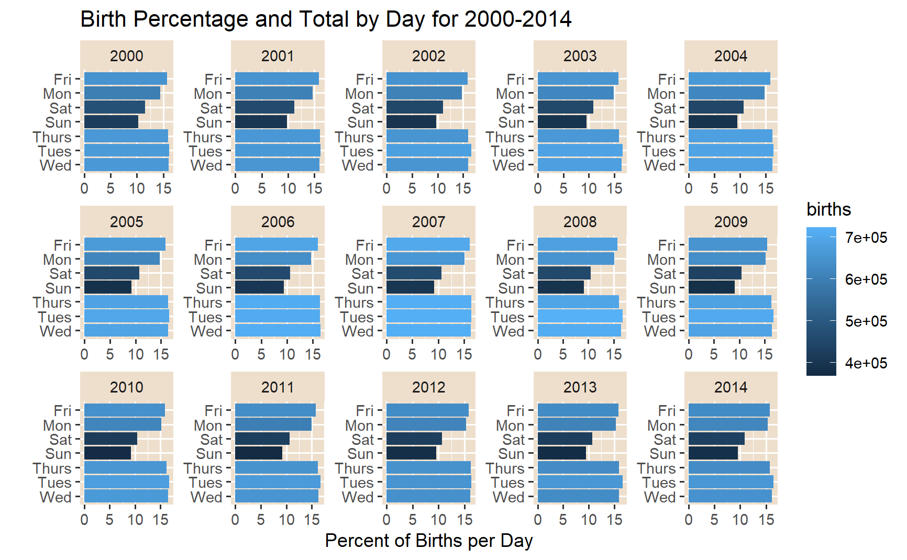
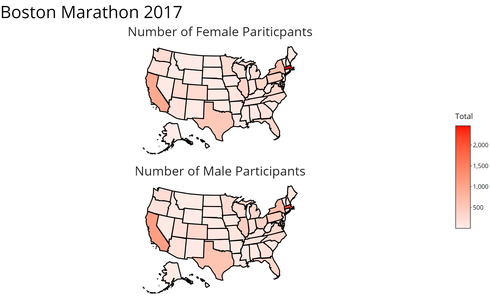
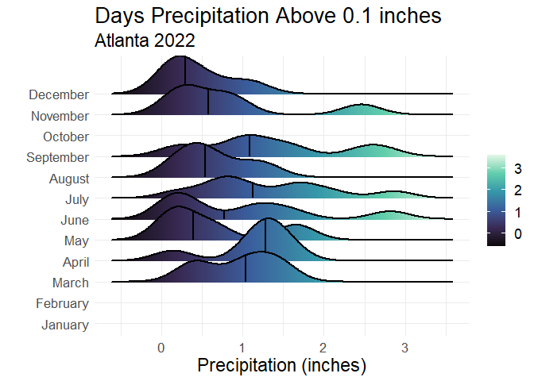
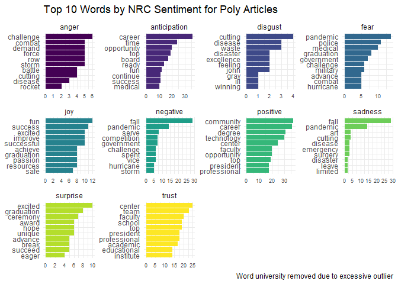

# Data Visualization and Reproducible Research

> Alex HUghes [ahughes3300\@floridapoly.edu](mailto:ahughes3300@floridapoly.edu){.email}

Learn more about me in my [GitHub profile page](https://github.com/ahughes3300).

The following is a sample of products created during the *"Data Visualization and Reproducible Research"* course.

------------------------------------------------------------------------

## Project 01

In the `project_01/` folder you can find an Exploratory analysis about  U.S. births data for the years 2000 to 2014. Here I used two line graphs, a facet wrap column graph and a lollipop graph to explore the data set.

**Sample: Binned Birthrates From 2000-2014:**

{width="571"}

------------------------------------------------------------------------

## Project 02

In `project_02/` I explored the 2017 Boston Marathon data set. A cloropleth map of US participants was created. Linear modeling was used to examine the data, discovering age and later distance times had a significant correlation to finish time. Finally an interactive shiny app was created to compare the top 300 runners to each other.

**Sample data visualization:**

------------------------------------------------------------------------

## Project 03 Part 1

In `project_03/` Part 1 of this project plotted various Density graphs for the max temperature and precipipation for Atlanta 2022.

**Sample data visualization Part 1:**

{width="594"}

------------------------------------------------------------------------

## Project 03 Part 2

In `project_03/` part 2 I did a NRC text sentiment analysis of a data set of articles about Florida Polytechnic University.

**Sample data visualization Part 02:**

------------------------------------------------------------------------

### Moving Forward

*I learned a lot about the data visualization, including grammar of graphics, Gestalt principles, R* syntax and organization, ggplot2, shiny applications, color principles, data story telling, *reproducible research,* using git and many more things*.*

I really enjoyed the creativity this course allowed and hope to continue to hone in on that creative thought process. I would like to explore public data sets to make interesting discoveries. I would like to continue to learn more advanced visualization techniques and critical thinking.
