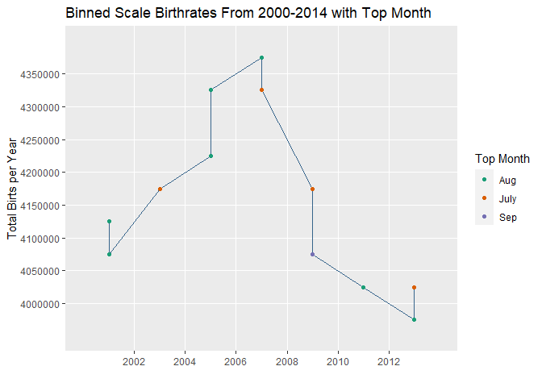
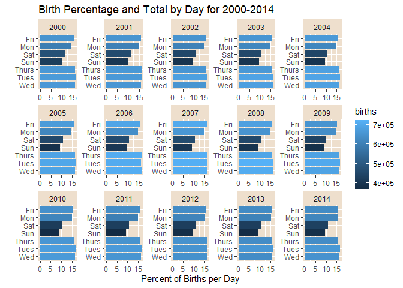
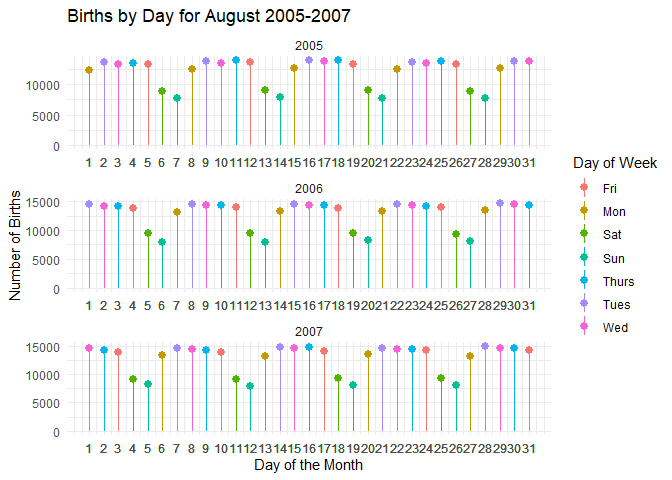

# Data Visualization Project 01

## Report

### Original Charts I Originally Planned

The data used was the U.S. births data for the years 2000 to 2014. This dataset has the Birthrates for the years 2000-2014 which includes the year, month, day of the month, day of the week and total births for that day. When viewing the data I wanted to create a line graph displaying the top births by year, I also liked the example of the rat sightings that was given and wanted to do something similar, and for the final graph I had planned on building was a lollipop graph.

### First Graph: Birthrates From 2000-2014

<!-- -->

-   I started exploring the data first by doing a general analysis of the total of births for every year. This graph was meant to be a very simple and general graph that can be used as a starting point. Using this simple line graph, I was able to see the years with the highest number of births.

-   This graph was meant to be a very simple graph to start analysis and as such I used the design principles of keeping it very simple. The line is a bold red line with a high contrast to the gray background that draws immediate attention to the line and makes it stand out.

-   The role of the story for this graph is an introduction, it is meant as a simple quick graph to grab the attention of the viewers and lead them into the next more complicated graph.

### Second Graph: Birthrates From 2000-2014 with Top Month

<!-- -->

-   I wanted to add some more complexity to the previous graph, so I created a second line graph and added the month with the most births or top month for each year as points on the line. This helped with telling the viewer which month had the highest birth per year and also works to mark the point at which the year intersects the brithrate line. To differentiate it from the prevous graph I treid a different scale of binning. This graph is more boxy but still is the same shape.

-   I used dark colors for from pallet Dark2 to help contrast with the light gray background and also used a dark color for the line. I didn't want to use black, so I used steelblue4 as it was dark but not totally devoid of color. I also added a full range of years at the x-axis to help balance the bottom the graph with the title at the top and by doing this I eliminated the need for an x-axis title all together as it was obvious what the axis represented.

-   The story this graph tells continues directly off the previous graph and adds more to the story. Here you can see there is a sharp increase in births for the years 2003 to 2007 and then followed by a sharp decrease in the years 2007 to 2013. It shows that there are only three months that were the top months from 2000-2014 being August, July and September. A quick view can show that August dominates as a top month followed by July and with September barely having a presence with only one point.

### Third Graph: Birth Percentage and Total by Day for 2000-2014

<!-- -->

-   After exploring totals and months I decided to focus on days and percentages. I wanted to see the similarities or difference for the births of each year by the day. I took the percentage of births for each day by year and graphed this using facet_wrap. This produced several small graphs each showing the percentage of births that each day represents for that year. I originally thought about putting the total number of births for each day, but this seemed clunky with the large numbers that were being used. I looked for a way to use smaller numbers, so I used percentages. I decided to keep the totals as a color to help correlate with the percentages.

-   The story told here shows that each year has very similar makeups with weekends being having the lowest percentage of births for every year. The pattern here is very similar for each year with only minor variation. You can also see with the color the of lighter blue (representing higher births) in years 2006-2009 especially in the days Tuesday, Wednesday and Thursday. This is because these years are the years with the most births and represent the peak seen in the previous graph. This can also be seen with the first row being darker blue (less births) the middle row being lighter blue and again the third row being darker blue again representing the increase, the peak and finally the decline of births.

-   Design elements are the facet wrap which gives a great mini graph for each year. Each graph is small but easy to read and follow. I chose the color pallet Dark2 again to help contrast with the lighter background. The background color was selected to be a light orange color because orange is complimentary color to blue. I chose to include the percent scale on the x-axis for each graph to help balance out the overall aesthetic of the graph with the y-axis weekday label.

### Finale Graph: Birthrates by Day for August 2005-2007

<!-- -->

-   For the final graph I was planning on using a lollipop graph. I liked how the facet-wrap worked out on the previous graph and chose to continue using it. I wanted to try another graph type that was different from the previous two graphs. I also wanted to break down some data into a subset and explore the data on a smaller zoomed in scale.

-   For story told I already explored births by year and months, then years and days, the final graph adds days of the month and combines that with years and day of the week. The subset chosen was based on the second line graph that shows raise and peak of births being the years 2005 to 2007 and with August being the top month for all three of these years. The final graph zooms in on this time frame and expands with individual days of August. Looking at the three graphs you one can see a distinct pattern of color and shape. While each individual day make not compare year to year the general pattern of colors and shape aligns well with the three years. Here can see this pattern repeats for the whole month for all years.

-   For design I chose lollipop graphs because they are bring attention to totals at line peaks and are visually pleasing when combined with colors. Here the colors represent the days of the week and it is easy to look up and down the three graphs to see a pattern. Even though the days may not match in each year exactly the patterns are overall similar and the graphs leads the eyes to easily discover this. I also used a theme_minimal here to help the each bar pop out in the background and reduce visible clutter.
