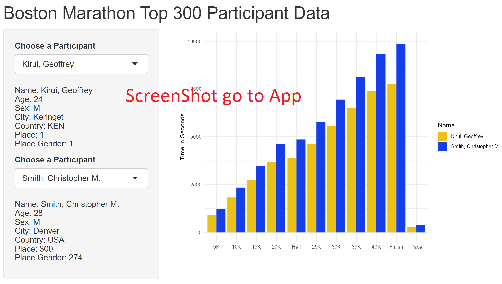

```{r}
library(tidyverse)
library(usmap)
library(ggplot2)
library(broom)
library(lubridate)
library(plotly)
```

```{r}
### Read in data
marathon_usa_sex_pace <- read_csv("../data/marathon_usa_sex_pace.csv")

### create a choropleth
p <- plot_usmap(data = marathon_usa_sex_pace, values = "number", color = "black",)+scale_size_continuous(range = c(min(marathon_usa_sex_pace$n), max(marathon_usa_sex_pace$n)))+  scale_fill_continuous(
    low = "#FEEBE7", high = "red", name = "Total", label = scales::comma
  ) + theme(legend.position = "right")+
  facet_wrap(~ Sex,ncol = 1,labeller = as_labeller(c('F' = "Number of Female Pariticpants", 'M' = "Number of Male Participants"))) +ggtitle(label = "Boston Marathon 2017")

p2<-p + theme(
  legend.position = c(1, .3), 
  legend.background = element_rect(fill = "white", colour = NA),
  strip.background = element_blank(),
 plot.title = element_text(size=20),
 strip.text = element_text(size=15),
 panel.spacing = unit(2, "lines"),
  plot.caption = element_text("State of Participants Origin")
 
)
#ggplotly(p2) 
```

```{r}
source("../scripts/project2_scripts.R")
project2_graph1_map()
```

####model

```{r}

### read in and process data
marathon <- read_csv("../data/marathon.csv")
marathon <- na.omit(marathon)
marathon$Half<- hms(marathon$Half)
marathon$OfficialTime<- hms(marathon$OfficialTime)
marathon$tenK<- hms(marathon$tenK)
marathon$thirtyK<- hms(marathon$thirtyK)
marathon$Pace<- hms(marathon$Pace)

marathon$Half<- as.numeric(marathon$Half)
marathon$OfficialTime<- as.numeric(marathon$OfficialTime)
marathon$tenK<- as.numeric(marathon$tenK)
marathon$thirtyK<- as.numeric(marathon$thirtyK)
marathon$Pace<- as.numeric(marathon$Pace)

```

```{r}
### create models
m2_model <- lm(OfficialTime ~ tenK + Half + thirtyK,
                    data = marathon)
tidy(m2_model)
m2_coefs <- tidy(m2_model, conf.int = TRUE) %>% 
  filter(term != "(Intercept)")  
#m2_coefs
m3_model <- lm(OfficialTime ~ tenK + Half + thirtyK+Age,
                    data = marathon)
tidy(m3_model)
m3_coefs <- tidy(m3_model, conf.int = TRUE) %>% 
  filter(term != "(Intercept)")  
#m3_coefs
```

```{r}
###create coefficent plot
lables2<-c("30K","10K", "Half Race","Age")

pco<-ggplot(m3_coefs,
       aes(x = estimate, 
           y = fct_rev(term))) +
  geom_pointrange(aes(xmin = conf.low, 
                      xmax = conf.high, color=fct_rev(term)),size=.75) +
  geom_vline(xintercept = 0, 
             color = "purple") + 
  scale_color_brewer(palette="Set1")+
  theme_minimal()+labs(title = "Linear Model Coefficents for Finish Time", x= "Estimate Coefficent", y="Distance Run")+scale_color_discrete(name="Distance Run", labels=lables2)+scale_y_discrete(labels=lables2)
#pco
```


```{r}
ggplotly(p2) 
```
## Spatial Visualization

1.  What I originally wanted to make was a world map showing the participants origins. However when going through the data it become apparent that there wasn't high number participants represented outside the USA in comparison to inside the USA. So I switched to a USA map and decided to show the participants by state. I further divided the data by Sex to see if there were any visual differences. The steps I took were filtering out the non USA participants and then further dividing them up by sex. I then summed the amount of each per state and created a new data frame to graph the data. Finally I wanted to have something interactive so I decided to use ggplotly so you can see the individual numbers per state.

2.  Looking at this map you can see two things. That the general distribution of male and female participants is very similar as the colors for each state look similar. Also you can see which states have the most participants with Massachusetts having the most. This makes sense because the marathon is hosted in Boston. However whats interesting the second state is California. I think this is interesting because California is so far away from Massachusetts. It's also fun to see that they also had participants from Alaska and Hawaii.

3.  I kept the design simple and used a base red color to make the populations stand out more, and kept it to one color. I made the title left aligned because the viewers eyes tend to view the left. I used a facet style graph to show side by side the male and female participants in a way that was easy to see. I used ggploty to make the map interactive so you can hover over every plot and see the numbers. This draws in the user to use the map.

```{r}
ggplot() +
  geom_smooth(aes(x = tenK, y = OfficialTime), data = m2_model, 
              method = "lm", se = FALSE, color = "red4") + 
  geom_smooth(aes(x = Half, y = OfficialTime), data = m2_model, 
              method = "lm", se = FALSE, color = "blue4") + 
  geom_smooth(aes(x = thirtyK, y = OfficialTime), data = m2_model, 
              method = "lm", se = FALSE, color = "green4") + 
  geom_point(aes(x = tenK, y = OfficialTime), data = m2_model, color = "red",alpha = 0.02)+
  geom_point(aes(x = Half, y = OfficialTime), data = m2_model, color = "blue",alpha = 0.02) +
  geom_point(aes(x = thirtyK, y = OfficialTime), data = m2_model, color = "green",alpha = 0.02)+ 
annotate('text', x = 5100, y = 27000, label = 'Ten K',size = 5,angle='68', color= 'red4')+ 
annotate('text', x = 11000, y = 25500, label = 'Half Race',size = 5,angle='51', color= 'blue4')+ 
annotate('text', x = 18000, y = 27500, label = 'Thrity K',size = 5,angle='41', color= 'green4')+labs(
  title = "Linear Model Line for Offical Time by Distance Time", x= "Distance Time in Seconds", y="Finish Time in Seconds")+theme_minimal()


```

```{r}
source("../scripts/project2_scripts.R")
Project2_graph2_lm()
```

## Linear Model Line Plot

1.  For the model I originally planed to create a line with geom_smooth and a linear model. I created a  linear model then used the linear model data to draw three lines with its associated plot cloud. I also had to convert the time to seconds. I also originally wanted to plot age but it didn't turn out good.

2.  Looking at the data you can see the plot cloud for the three different distances over Finish time. You can see where each distance as a linear model and how it associates with what it predicts where the finish time should be compared to the time at the associated distance. You can see the slopes of the predicted lines. The story you can tell here is you can follow the line and see if you passed a distance at x time your finish them will likely be y time. A runner can use this to target times they need to meet. This is followed for each of the three distances. I had difficulty here adding Age as a component it doesn't seem to create a usable line.

3.  I continued to keep the design simple with bright colors to clash against the white background. I'm a fan of theme_minimal and think it does a good job of decluttering the graph. I added a opacity to the plot points because they were so thick you couldn't see the lines. For each line I added an annotation to identify which line goes to with variable distance.

```{r}

pco
```

```{r}
source("../scripts/project2_scripts.R")
Project2_graph3_coef()
```


## Model Visualization Coefficient Plot

1.  For the model I originally planed to create a coefficient plot. I wanted to have more elements originally but I decided to keep it simple and limit it to four plot elements, early in the race, middle of the race and late in the race and finally age. I found that adding more distances was somewhat redundant and complicated the model. The steps I took were running the variables through a linear model, then getting the coefficients and converting the information into to tidy data.

2.  Looking at this map you can see the coefficients and it has a vertical line at zero. Points that are close to the zero don't have much bearing on the outcome. Looking at the plots you can see that 10K is close to the zero line. You can also see that Half race has a value of -1.3 which has a negative influence on the outcome and that 30K is 2.3 positive and has very strong bearing on the overcome of the Finish Time. The Story here is that how you do early in the race has much less effect on your finishing time than how you do later in the race. One last coefficient I threw in here for the graph is Age, you see that Age age has large bearing on your Finish Time. Difficulties I had were the linear model function in R would not take it in time properly I had to change all the times to seconds.

3.  Again I kept design of the graph simple. I have a line in the graph to easily show where zero is. the points are large and easy to see. The theme used here is a minimal theme. I used a SET2 palette to make the colors pop against the white background.

## Interactive Visualization

#### Go to Interactive_Viz.R and select run app to load up interactive bar graph. Below is a screenshot of the app for reference purposes.



***Shiny App requires loading up***

**Go to Interactive_Viz.R and select run app to load up Shiny interactive bar graph. Above is a screenshot of the app for reference purposes.**

1.  For my final visualization I wanted to create a shiny application. I decided on displaying the running information for each distance segment on a bar graph and I wanted to make it selectable for each runner in the marathon. I later decided to make a second selectable pull down menu so you can compare two runners information to each other. To prepare the data I had to filter out all the missing or bad data. I also had to cut down the size of my data frame to 300 because large sizes were causing errors.

2.  This map allows an interesting story , you can select two different runners. You can compare their different times at each distance. On the left side you get personal information about the runner such as name, sex, country of origin and age. I used up nearly all the variable information in the dataframe and feel I represented it well in the graph. I had difficulty with the dataframe at full size and had to limit the graph to the top 300 participants. I think I was running out of memory on my computer with a larger dataset, but I am not sure.

3.  The interactive visualization is fairly self explanatory On the left in a clearly marked box you can select between two drop menus. The names for the top 300 runners are in each menu. When you select participant their information is listed below and the graph to right is updated to display each runners times per distance run along with their pace. You can then directly compare two runners. I chose bar graphs because they easily display the information and fill up the available space to make it easy to see. I kept the rest of the graph simple with easy to understand legend and labels and used a minimal theme. I chose the colors yellow and blue because they are the colors of the Boston Marathon and very close to being complimentary colors. I decided on changing from seconds to minutes because people understand minutes in large numbers more than seconds.
