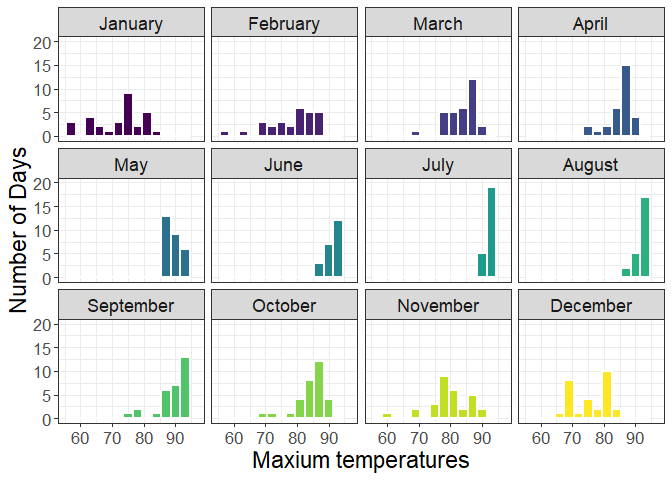
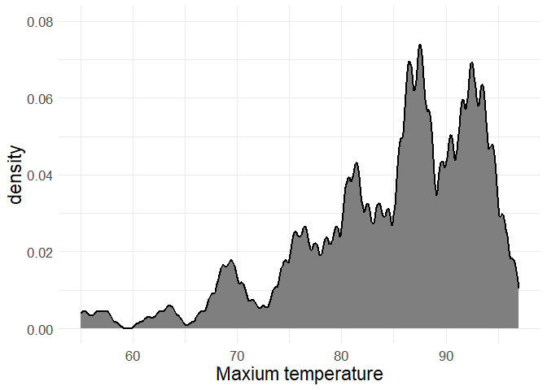
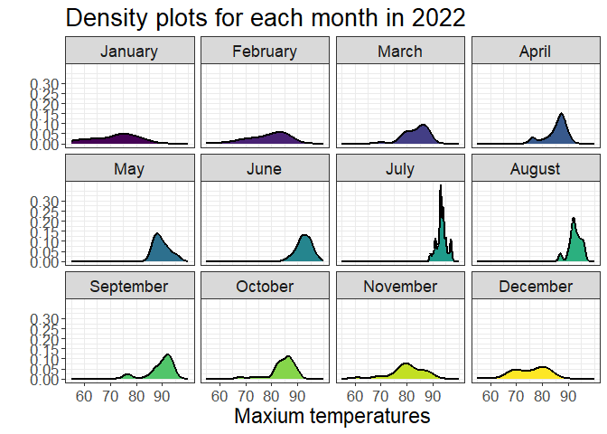
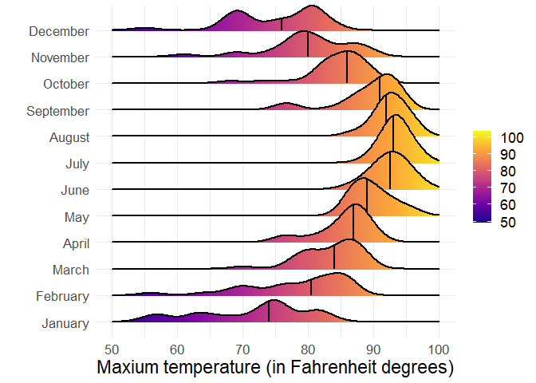
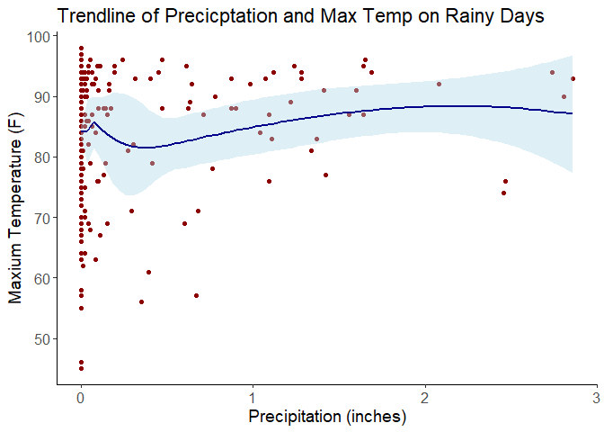
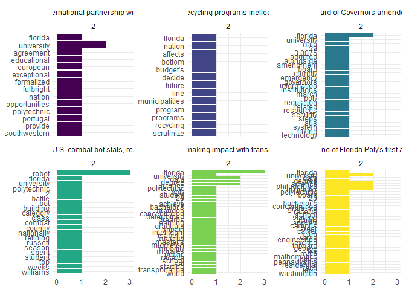
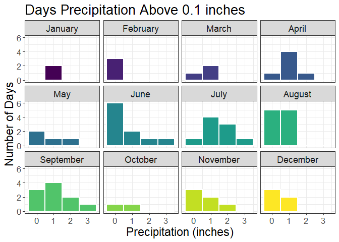
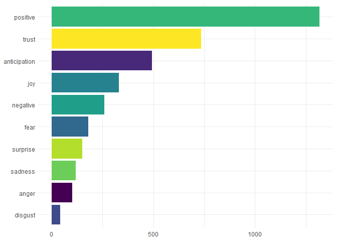

# Data Visualization Project 03

In this exercise you will explore methods to create different types of data visualizations (such as plotting text data, or exploring the distributions of continuous variables).

## PART 1: Density Plots

Using the dataset obtained from FSU's [Florida Climate Center](https://climatecenter.fsu.edu/climate-data-access-tools/downloadable-data), for a station at Tampa International Airport (TPA) for 2022, attempt to recreate the charts shown below which were generated using data from 2016. You can read the 2022 dataset using the code below:


```r
library(tidyverse)
library(ggplot2)
library(viridis)
library(ggridges)
library(tidytext)
library(scales)
source("../scripts/project3_scripts.R")
weather_tpa <- read_csv("https://raw.githubusercontent.com/reisanar/datasets/master/tpa_weather_2022.csv")
# random sample 
samplen<-sample_n(weather_tpa, 4)
```

See <https://www.reisanar.com/slides/relationships-models#10> for a reminder on how to use this type of dataset with the `lubridate` package for dates and times (example included in the slides uses data from 2016).

Using the 2022 data:

(a) Create a plot like the one below:


Hint: the option `binwidth = 3` was used with the `geom_histogram()` function.


```r
P1A_graph()
```



(b) Create a plot like the one below:


Hint: check the `kernel` parameter of the `geom_density()` function, and use `bw = 0.5`.


```r
source("../scripts/project3_scripts.R")
p1B_graph()
```



(c) Create a plot like the one below:


Hint: default options for `geom_density()` were used.


```r
source("../scripts/project3_scripts.R")
p1C_graph()
```



(d) Generate a plot like the chart below:


Hint: use the`{ggridges}` package, and the `geom_density_ridges()` function paying close attention to the `quantile_lines` and `quantiles` parameters. The plot above uses the `plasma` option (color scale) for the *viridis* palette.


```r
source("../scripts/project3_scripts.R")
p1D_graph()
```



(e) Create a plot of your choice that uses the attribute for precipitation *(values of -99.9 for temperature or -99.99 for precipitation represent missing data)*.


```r
source("../scripts/project3_scripts.R")
p1E_graph()
```




```r
  tpa_clean <- weather_tpa %>% 
    unite("doy", year, month, day, sep = "-") %>% 
    mutate(doy = ymd(doy), 
           max_temp = as.double(max_temp), 
           min_temp = as.double(min_temp), 
           precipitation = 1 * as.double(precipitation))


t2 <- tpa_clean %>% filter(precipitation >= 0.1
)


  ggplot(t2, aes(x = precipitation, y = month(ymd(doy),label=TRUE,abbr = FALSE), fill = stat(x))) +
    geom_density_ridges_gradient(size=1,quantile_lines = TRUE,quantiles = 2)+
    scale_fill_viridis_c(name = "Depth", option = "G") +
    theme_minimal()+xlab("Precipitation (inches)") + ylab("")+
    theme(axis.text = element_text(size = 13),text = element_text(size = 17),legend.title = element_blank()) +
    labs(color = NULL)  +
    xlab("Precipitation (inches)") + ylab("Number of Days")+ggtitle("Days Precipitation Above 0.1 inches")
```

```
## Warning: `stat(x)` was deprecated in ggplot2 3.4.0.
## ℹ Please use `after_stat(x)` instead.
## This warning is displayed once every 8 hours.
## Call `lifecycle::last_lifecycle_warnings()` to see where this warning was
## generated.
```

```
## Picking joint bandwidth of 0.246
```

```
## Warning: Using the `size` aesthetic with geom_segment was deprecated in ggplot2 3.4.0.
## ℹ Please use the `linewidth` aesthetic instead.
## This warning is displayed once every 8 hours.
## Call `lifecycle::last_lifecycle_warnings()` to see where this warning was
## generated.
```

<!-- -->

```r
  ggplot(t2, aes(precipitation, fill=month(ymd(doy),))) +
    geom_histogram(binwidth=1,colour = "white",
                   lwd = 0.8,
                   linetype = 1,
                    position = "identity")+ facet_wrap(~month(ymd(doy),label=TRUE,abbr = FALSE))+ scale_fill_viridis(guide = "none")+theme_bw() + theme(axis.text = element_text(size = 13),text = element_text(size = 17))  +
    xlab("Precipitation (inches)") + ylab("Number of Days")+ggtitle("Days Precipitation Above 0.1 inches")
```

<!-- -->

## PART 2

> **You can choose to work on either Option (A) or Option (B)**. Remove from this template the option you decided not to work on.

### Option (A): Visualizing Text Data

Review the set of slides (and additional resources linked in it) for visualizing text data: <https://www.reisanar.com/slides/text-viz#1>

Choose any dataset with text data, and create at least one visualization with it. For example, you can create a frequency count of most used bigrams, a sentiment analysis of the text data, a network visualization of terms commonly used together, and/or a visualization of a topic modeling approach to the problem of identifying words/documents associated to different topics in the text data you decide to use.

Make sure to include a copy of the dataset in the `data/` folder, and reference your sources if different from the ones listed below:

-   [Billboard Top 100 Lyrics](https://github.com/reisanar/datasets/blob/master/BB_top100_2015.csv)

-   [RateMyProfessors comments](https://github.com/reisanar/datasets/blob/master/rmp_wit_comments.csv)

-   [FL Poly News Articles](https://github.com/reisanar/datasets/blob/master/flpoly_news_SP23.csv)

(to get the "raw" data from any of the links listed above, simply click on the `raw` button of the GitHub page and copy the URL to be able to read it in your computer using the `read_csv()` function)




#### NRC Sentiment Totals for All FL Poly Articles

-   **Data Source**: [flpoly_news_SP23.csv](https://github.com/reisanar/datasets/blob/master/flpoly_news_SP23.csv)

-   **Analysis:** Positive is by far the largest of the NRC sentiments for the articles with disgust being the lowest value. Overall all good emotions are associated with Florida Polytechnic in the articles.

-   **Issues**: The word University was removed due to be an extreme outline, over 400 occurrences, and also being associated with the name Florida Polytechnic University as a place. 

-   **Story:** The story that can be told here is what is being written about Florida Polytechnic University is associated with positive sentiment and low on negative sentiment. Public peception of Florida Polytechnic is good.


#### NRC Sentiment Totals for All FL Poly Articles

-   **Data Source**: [flpoly_news_SP23.csv](https://github.com/reisanar/datasets/blob/master/flpoly_news_SP23.csv)

-   **Analysis:** This is more of a granular approach than the generalized graph above. Here the details of the top 10 words per sentiment are shown. Community is the number 1 positive word and fall is the number 1 negative word. It is intesting if NRC should be seperated out by meaning the word, it is likely that fall here means a season and not actually falling to the ground. 

-   **Issues**: The word University was removed due to be an extreme outline and also being associated with the name Florida Polytechnic University as a place.

-   **Story:** The story that can be told here is once again an overall positive sentiment. It is easy to see from the graph that positive sentiments like joy and trust are much thicker than negative sentiments such as fear and sadness. 
